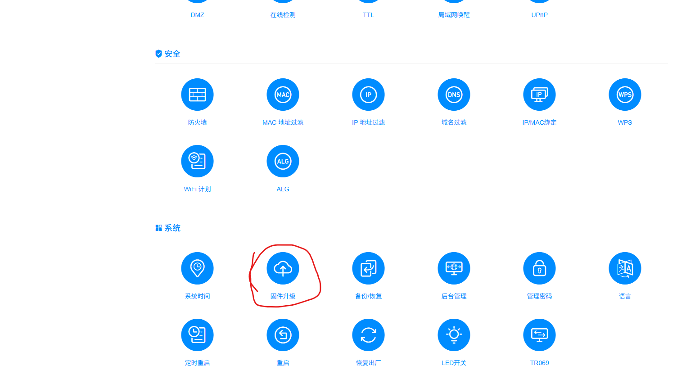
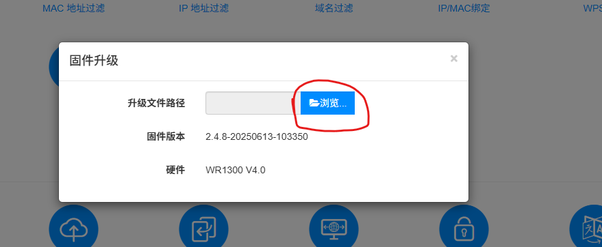
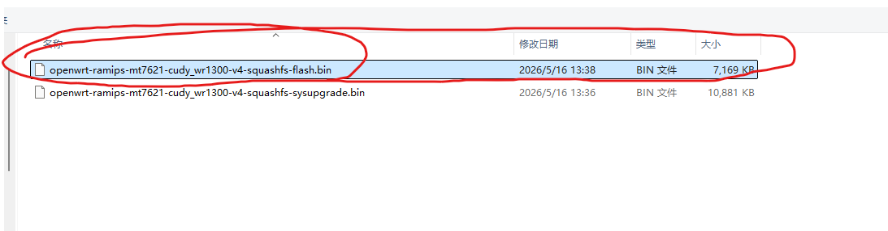
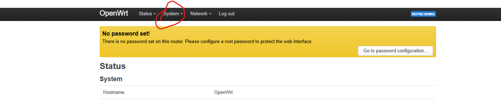
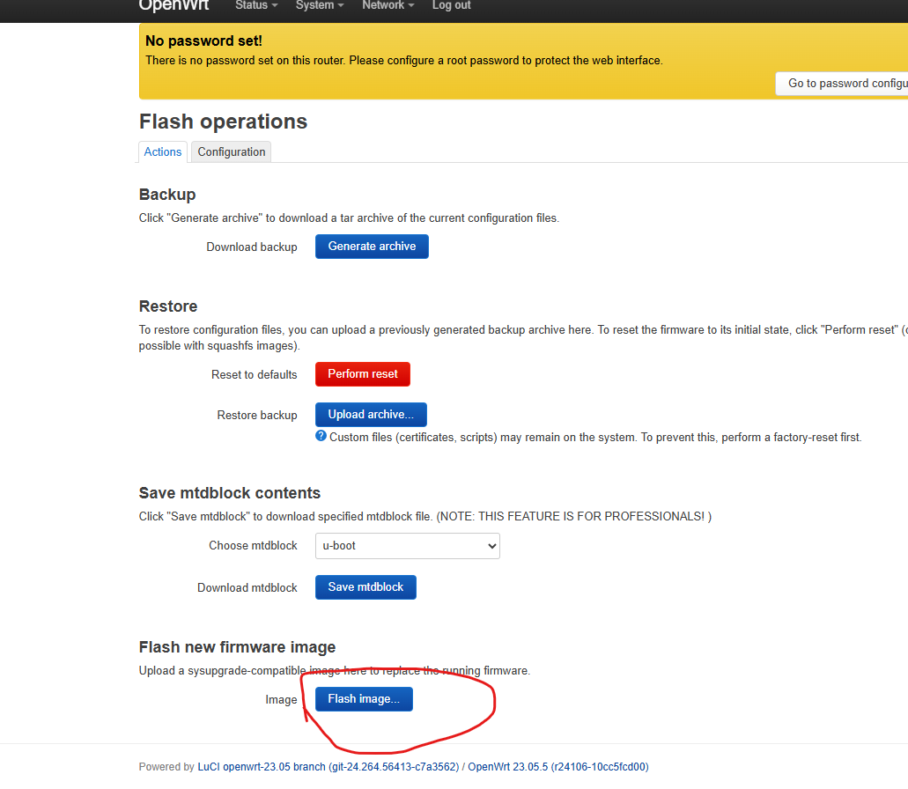
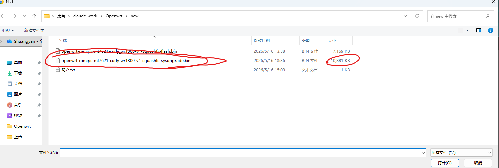
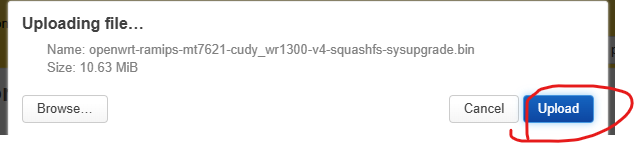
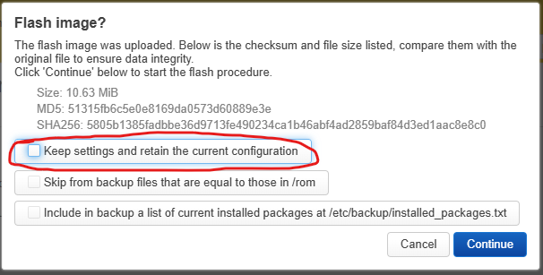
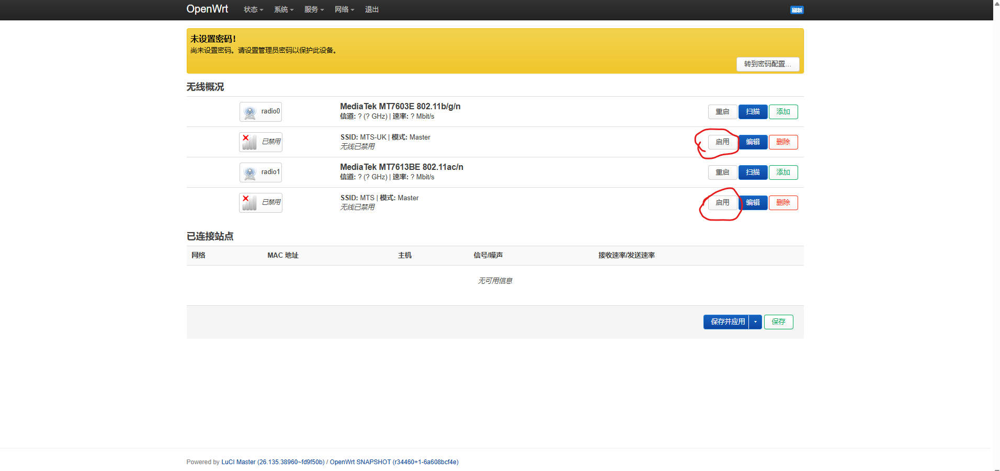

# OpenWrt Custom Firmware for Cudy WR1300 v4

## [中文教程](README.md) | English Tutorial

I have finished compiling the firmware, and all functions are working properly. The LED lights are also functioning normally.

Here are the original factory firmware and the firmware I compiled:

- [openwrt-ramips-mt7621-cudy_wr1300-v4-squashfs-sysupgrade.bin](https://github.com/GuoShuangyan/Openwrt-Cudy-WR1300-v4/raw/master/openwrt-ramips-mt7621-cudy_wr1300-v4-squashfs-sysupgrade.bin)
- [openwrt-ramips-mt7621-cudy_wr1300-v4-squashfs-flash.bin](https://github.com/GuoShuangyan/Openwrt-Cudy-WR1300-v4/raw/master/openwrt-ramips-mt7621-cudy_wr1300-v4-squashfs-flash.bin)

First, prepare the official OpenWrt firmware and the one I compiled.

Then enter the official factory firmware interface, click on "Firmware Upgrade", upload the official OpenWrt firmware, and flash it.

After flashing is complete, enter the OpenWrt homepage. Next, perform the firmware upgrade again. Upload the firmware I compiled and proceed with the upgrade.

Do not keep any configuration here — uncheck the checkbox. Then click "Continue" to proceed with the upgrade.

After the upgrade is complete, enter the homepage. If you are not comfortable with Chinese, you can remove the Chinese language pack.

At this point, you will notice that the router's LED lights are working normally, but two lights are still off — the 2.4G and 5G signal indicators are not lit. This is because WiFi has not been enabled yet.

Next, let's enable WiFi.

After WiFi is enabled, the router's signal lights will turn on as well.

