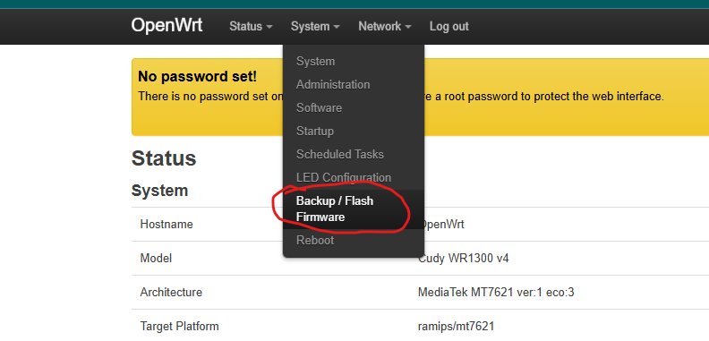
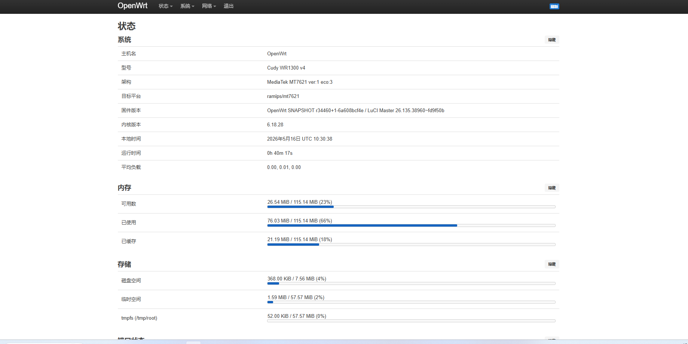
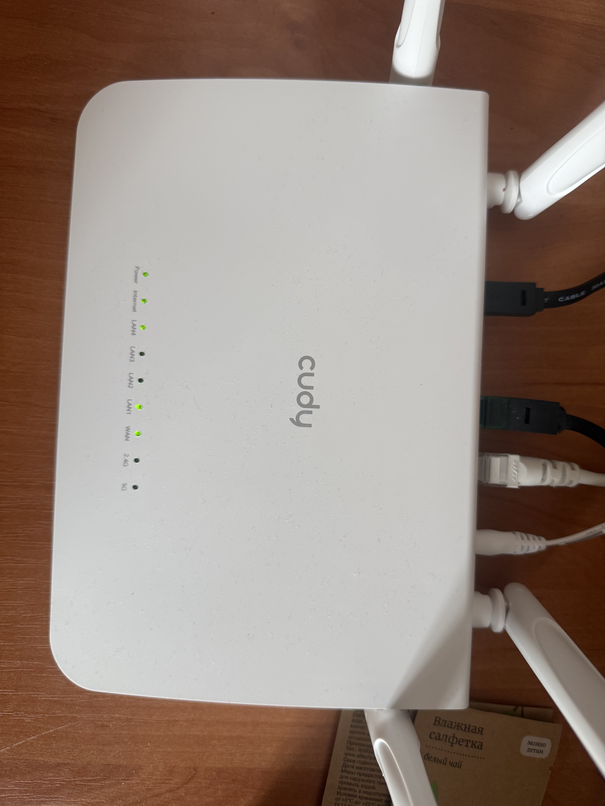
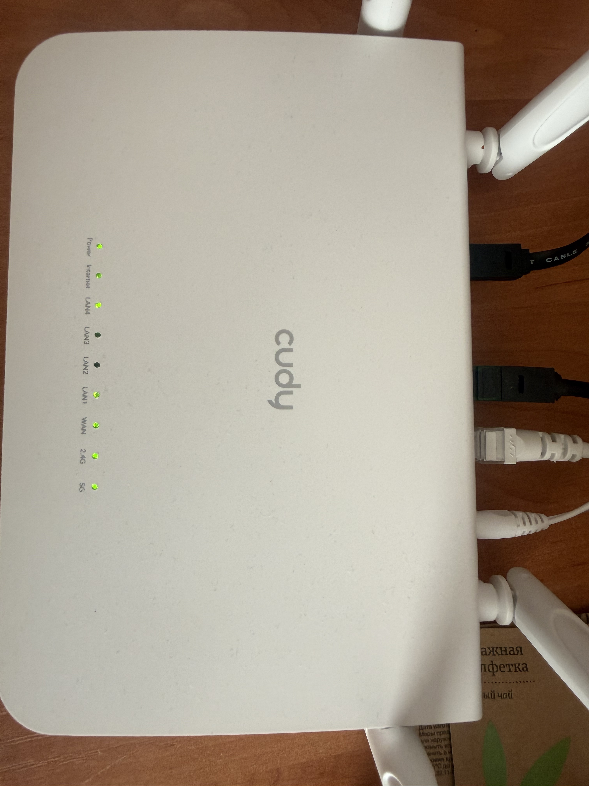

我已经将固件编译完成了，而且所有功能正常使用。LED灯也正常点亮。

这是原厂固件和我编译好的固件

 [openwrt-ramips-mt7621-cudy_wr1300-v4-squashfs-sysupgrade.bin](openwrt-ramips-mt7621-cudy_wr1300-v4-squashfs-sysupgrade.bin)  [openwrt-ramips-mt7621-cudy_wr1300-v4-squashfs-flash.bin](openwrt-ramips-mt7621-cudy_wr1300-v4-squashfs-flash.bin) 

首先将官方给的openwrt和我编译的openwrt准备好

然后进入官方原厂固件，点击固件升级，将官方给的openwrt固件上传上去，进行刷写。

刷写成功后，进入openwrt的首页，接下来再次进行固件升级。将我编译的固件上传，进行升级。

这里不要保留任何配置，将对号取消掉。然后点击 continue进行升级。

升级完成后进入首页。不习惯中文的可以将中文包移除。

这是你会发现路由器的led灯正常了，但是还有两个灯没有亮2.4G和5G的信号灯没有亮，那是因为WIFI还没有启用。

接下来我们启用WiFi。

WiFi启动后，路由器的信号灯也亮了起来。

